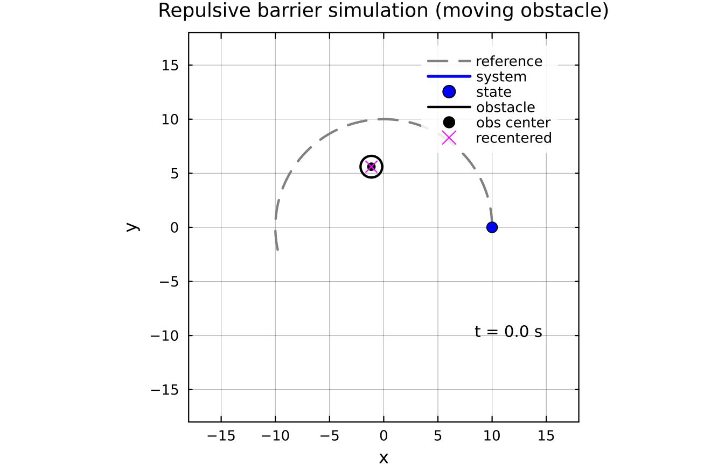

# RepulsiveBarriers

## Getting started
1. Download and install [Julia](https://julialang.org/). Installation instructions [here](https://docs.julialang.org/en/v1/manual/installation/).
2. Install [Jupyter](https://jupyter.org/).
3. Add required Jilia packages ... ([how?](https://docs.julialang.org/en/v1/stdlib/Pkg/))
   using Pkg;
   Pkg.add(["IJulia", "DynamicPolynomials", "Plots", "SumOfSquares", "MosekTools", "LinearAlgebra", "DifferentialEquations", "PyCall", "JuMP", "LaTeXStrings"]
   
4. Now clone this repo
5. Run jupyter notebooks for each case study
6. All plots are saved in the 'figures' folder

